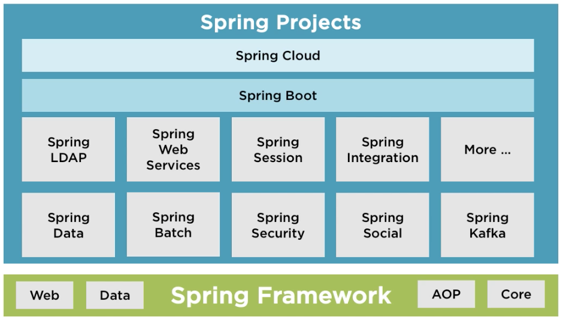

# Spring: The Big Picture

> Note: A pluarsight course by Dustin Schultz


## What is Spring?

- Spring Framework
- Spring Boot
- Spring Data
- Spring Cloud
- Spring Batch
- And more!

> "Most often, when people say 'Spring', they mean the entire family of projects." 
>
> -Spring Framework Reference Documentation




### Why Spring?

> "Spring makes it easy to create Java enterprise applications." 
>
> -Spring Framework Reference Documentation

- Flexible, modular, and backwards compatable
- Large and active community
- Continually innovates and evolves
- Opensource and fully backed by **Pivotal**


## Getting to Know Spring with Spring Boot

> "Spring Boot makes getting started with Spring quick and easy"

Spring boot can be used to build web and not-web apps.

Notable Features:

- Auto-configuration
- Standalone
- Opinionated


### Spring Boot Auto-configuration

> "… attempts to automatically configure your Spring application based on the … dependencies that you have added."

Auto-configurations are contextually aware and smart.

#### Setting up Auto-configuration is effortless:

```java
@EnableAutoConfiguration
public class DemoApplication {
    ...
}
```


### Standalone apps that "Just run"

> "Spring Boot makes it easy to create stand-alone, production-grade, Spring-based applications that you can 'just run'."
>
> -Spring Boot Project

1. Package application
2. Run the applicaiton `java -jar my-application.jar`


### An Opinionated View of Spring

> "Takes an opinionated view of building production-ready Spring applications."
>
> -Spring Boot Project

[Spring Initializer](http://start.spring.io)


## Understanding Spring's Foundations: The Spring Framework

