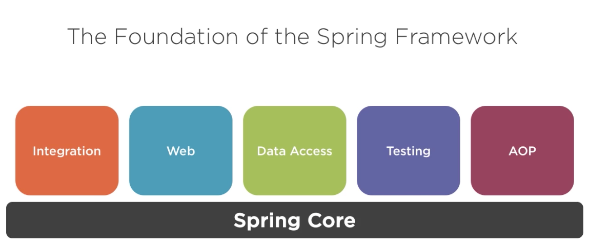
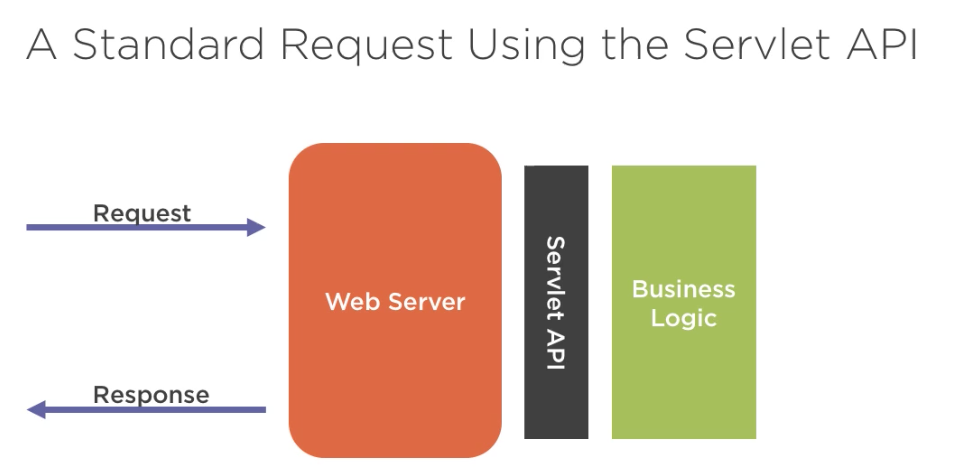
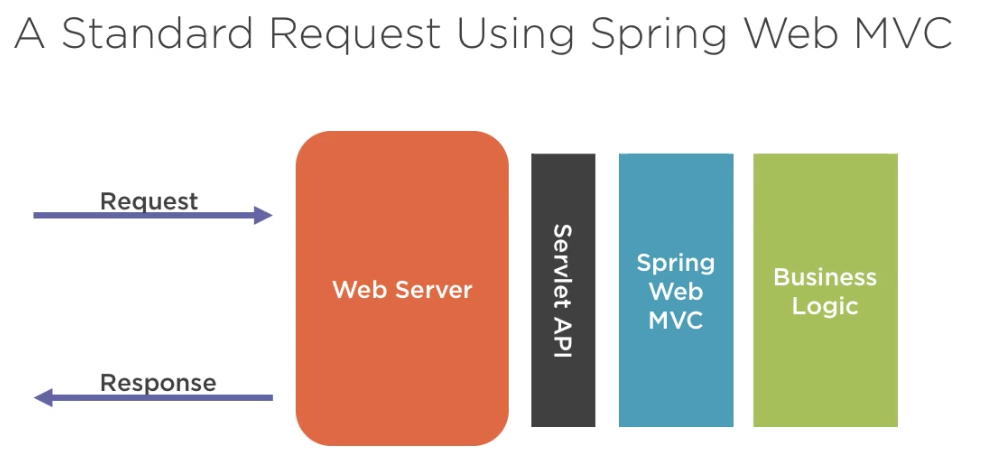
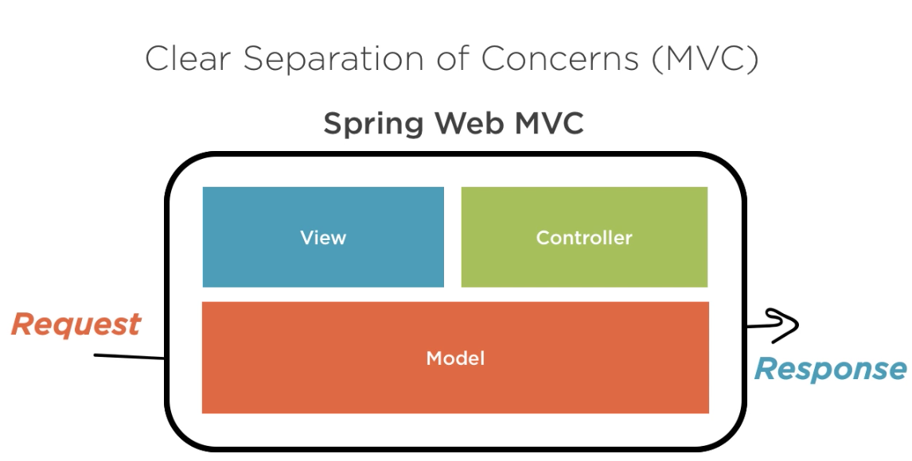

# Spring: The Big Picture

> Note: A pluarsight course by Dustin Schultz


## What is Spring?

- Spring Framework
- Spring Boot
- Spring Data
- Spring Cloud
- Spring Batch
- And more!

> "Most often, when people say 'Spring', they mean the entire family of projects." 
>
> -Spring Framework Reference Documentation


### Why Spring?

> "Spring makes it easy to create Java enterprise applications." 
>
> -Spring Framework Reference Documentation

- Flexible, modular, and backwards compatable
- Large and active community
- Continually innovates and evolves
- Opensource and fully backed by **Pivotal**


## Getting to Know Spring with Spring Boot

> "Spring Boot makes getting started with Spring quick and easy"

Spring boot can be used to build web and not-web apps.

Notable Features:

- Auto-configuration
- Standalone
- Opinionated


### Spring Boot Auto-configuration

> "… attempts to automatically configure your Spring application based on the … dependencies that you have added."

Auto-configurations are contextually aware and smart.

#### Setting up Auto-configuration is effortless:

```java
@EnableAutoConfiguration
public class DemoApplication {
    ...
}
```


### Standalone apps that "Just run"

> "Spring Boot makes it easy to create stand-alone, production-grade, Spring-based applications that you can 'just run'."
>
> -Spring Boot Project

1. Package application
2. Run the applicaiton `java -jar my-application.jar`


### An Opinionated View of Spring

> "Takes an opinionated view of building production-ready Spring applications."
>
> -Spring Boot Project

[Spring Initializer](http://start.spring.io)


## Understanding Spring's Foundations: The Spring Framework

The Spring Framework was the begining of Spring.

The Spring Framework is **modular**.


### The Spring Framework: Six Key Areas

- Core
- Web
- AOP - Aspect oriented programming
- Data Access
- Integration
- Testing


### Spring Core

> The foundational modual of which all other moduals are built.



- Spring Core provides dependency injection.

> Note: Spring Core creates and maintains objects and their dependencies.


### Spring Web

> A framework for handling web requests

This is done one of two ways:

- Spring Web MVC
- Spring Web Webflux


### Spring Web MVC

**(Java) Servlet**

> A Servlet is an object that receives a request and generates a response based on that request.
>
> -Wikipedia



Challenges:

- Somewhat low-level
- Not easy to use
- Less productive





Advantages:

- Higher Level API
  - Easier
  - More productivty (Better design principals)



> **MVC** stands for Model View Controller


### Spring Webflux

**Reactive Programming**

> "… a declarative programming paradigm concerned with data streams and the propagation of change"

**REACT** to change rather than **WAIT** for change!

- Asynchronous execution
- Doesn't block (wait)
  - Better resource utilization


### Spring AOP

**Aspect-oriented Programming**

> "A programming paradigm that aims to increase modularity by allowing the separation of cross-cutting concerns."
>
> -Wikipedia

A way of programming that increases organization of code for concerns that span multiple tiers or layers of an application.

- Used to implement features in Spring
- A valuable tool for developers to handle cross-cutting concerns


**Example: Application Security**

```java
// The PROBLEM!!!
public void sensitiveOperation() {
    // Check if user is authenticated and has the correct role
    if (...) {
        // do sensitive operation
    } else {
        // raise an error
        // log failed attempt
        // redirect
    }
}
```

``` java
// The SOLUTION!!!
@PreAuthorize("hasRole('admin')")
public void sensitiveOperation() {
    // do sensitive operation
}
```


## Spring Data Access

